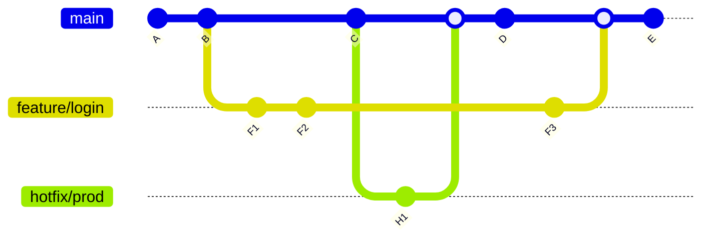
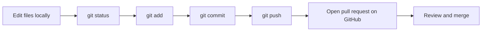

# Version Control Foundations

Version control is the practice of recording changes to files over time so you
can inspect history, return to earlier states, and collaborate safely.

## Why researchers and developers need it

Without version control, teams often end up with problems like:

- `final.py`, `final_v2.py`, `final_really_final.py`,
- uncertainty about who changed what,
- difficulty returning to a known working state,
- accidental overwriting of someone else's work,
- no clear record of why a change was made.

Git solves these problems locally, and GitHub adds a shared online space for
collaboration.

## The key idea

Think of Git as a history system for your project:

- a **repository** is the project plus its history,
- a **commit** is a saved checkpoint, respectively a set of changes,
- a **branch** is a separate line of work,
- a **merge** brings changes together,
- a **tag** marks an important version,
- a **remote** connects your local repository to a hosted one such as GitHub.

### Example

* the main branch with commits A, B, C, D & E
* a branch for the feature named 'login' consisting of commits F1, F2 and F3
* a branch for the hotfix named 'prod' consisting of commit H1

## Local Git vs. GitHub

Git and GitHub are related, but they are not the same thing:

- **Git** is the version control system installed on your machine.
- **GitHub** is a hosting and collaboration platform built around Git
  repositories.

You can use Git without GitHub, but GitHub becomes very useful once you want to
share work, review changes, publish documentation, or run automation.

## Why branches matter

Branches let you work on one change without destabilizing the main line of
development.

This matters for:

- adding a new feature,
- fixing a bug,
- restructuring files,
- trying something experimental,
- preparing a pull request for review.

Even in a small project, branches reduce stress because they give each change a
clear home.

## Semantic versioning and tags

Tags help you mark important milestones, such as releases.
One common scheme is semantic versioning:

- `v1.0.0` for the first stable release,
- `v1.1.0` for a backward-compatible feature release,
- `v1.1.1` for a backward-compatible bug fix.

You do not need a release-heavy workflow to benefit from tags. Even a few
well-placed milestones make history easier to navigate.

## A simple workflow picture

## What comes next

The next page focuses on what Git looks like on your own machine: initializing
repositories, checking status, staging files, committing, branching, and
synchronizing changes.
